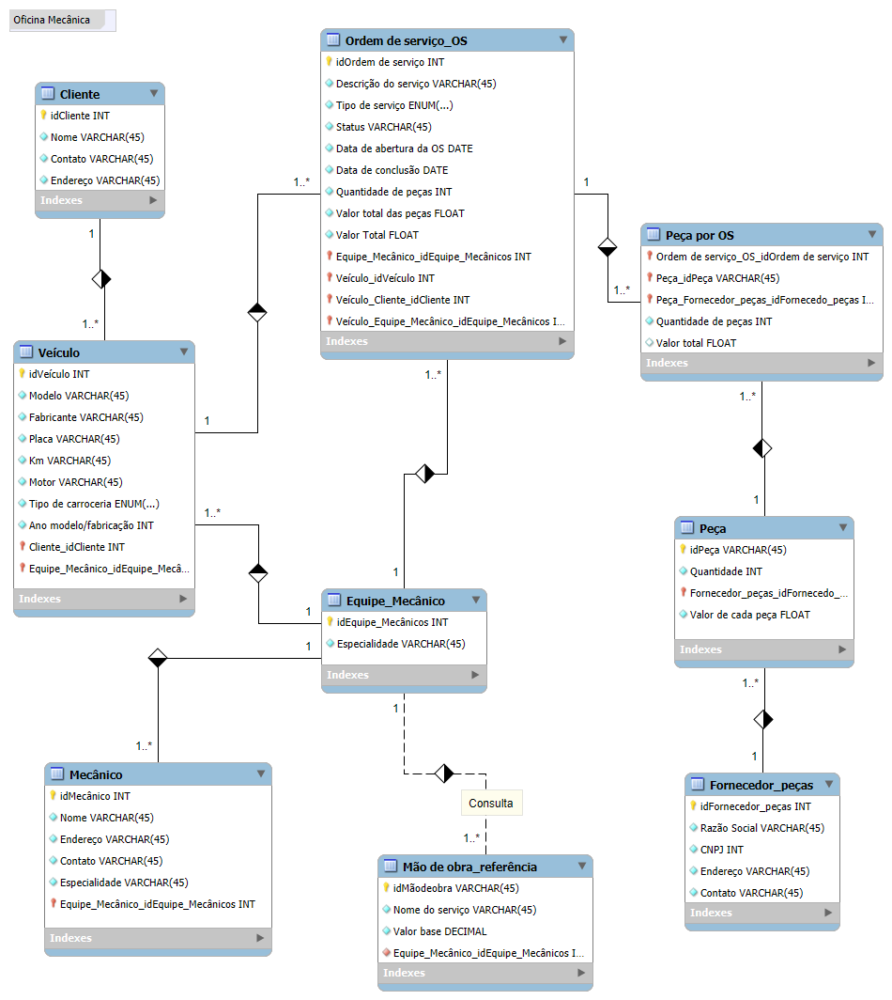

# Projeto "Abertura de OS  em Oficina Mecânica" - DIO Lab

A tarefa proposta durante o desafio "Construindo um Esquema Conceitual para Banco De dados", sob orientação de Juliana Mascarenhas, consistia em cria uma modelagem conceitual do zero para ordens de serviços recebidas em uma oficina mecânica.

## Narrativa e orientações:

-Sistema de controle e gerenciamento de execução de ordens de serviço em uma oficina mecânica;  
-Clientes levam veículos à oficina mecânica para serem consertados ou para passarem por revisões  periódicas;  
-Cada veículo é designado a uma equipe de mecânicos que identifica os serviços a serem executados e preenche uma OS com data de entrega;  
-A partir da OS, calcula-se o valor de cada serviço, consultando-se uma tabela de referência de mão-de-obra;  
-O valor de cada peça também irá compor a OS;  
-O cliente autoriza a execução dos serviços;  
-A mesma equipe avalia e executa os serviços;  
-Os mecânicos possuem código, nome, endereço e especialidade e,  
-Cada OS possui: n°, data de emissão, um valor, status e uma data para conclusão dos trabalhos.
  

Ferramenta utilizada: [MySQL Workbench](https://www.mysql.com/products/workbench)
